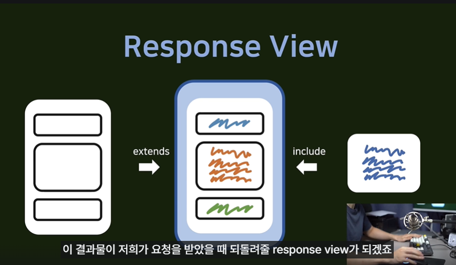

## Reference Site
[Reference URL: Inflearn Django](https://www.inflearn.com/course/%EC%9E%A5%EA%B3%A0-%ED%95%80%ED%84%B0%EB%A0%88%EC%8A%A4%ED%8A%B8)

## MVC Structure
Model
View
Templete(Controller)

## Routing
from django.urls import path
urls.py
urlpatterns = [
    path("log-in/",LogInView.as_view(), name="log_in")
]

--> localhost:8080/accounts/log-in

from django.contrib import admin
urlpatterns = [
    path("admin/", admin.site.urls),
    path("accounts/", include('accounts.urls')),
] >> accounts 앱의 urls 디렉터리 하위 구조로 변경한다.


# View
### Response View


git ignore > 7강


---------------------


# Simple Django Login and Registration

An example of Django project with basic user functionality.

## Screenshots

| Log In | Create an account | Authorized page |
| -------|--------------|-----------------|
|  |  |  |

| Password reset | Set new password | Password change |
| ---------------|------------------|-----------------|
|  |  |  |

## Functionality

- Log in
    - via username & password
    - via email & password
    - via email or username & password
    - with a remember me checkbox (optional)
- Create an account
- Log out
- Profile activation via email
- Reset password
- Remind a username
- Resend an activation code
- Change password
- Change email
- Change profile
- Multilingual: English, French, Simplified Chinese and Spanish

If you need dynamic URLs with the language code, check out https://github.com/egorsmkv/simple-django-login-and-register-dynamic-lang

## Installing

### Clone the project

```bash
git clone https://github.com/egorsmkv/simple-django-login-and-register
cd simple-django-login-and-register
```

### Activate virtualenv

#### Create a virtualenv using `uv`

```bash
uv venv --python 3.13

source .venv/bin/activate
```

#### Install dependencies

```bash
uv sync

# Or using requirements files:

uv pip install -r requirements.txt

# in development mode
uv pip install -r requirements-dev.txt
```

### Configure the settings (connection to the database, connection to an SMTP server, and other options)

1. Edit `source/app/conf/development/settings.py` if you want to develop the project.

2. Edit `source/app/conf/production/settings.py` if you want to run the project in production.

### Apply migrations

```bash
python source/manage.py migrate
```

### Running

#### On development server

Start the local web server:

```bash
python source/manage.py runserver
```

#### On production server

Collect static files:

```bash
python source/manage.py collectstatic
```

### Development

#### Check & format code

This following commands sort imports and format the code:

```bash
ruff check --select I --fix
ruff format
```

Format templates:

```bash
git ls-files -z -- '*.html' | xargs -0 djade --target-version '5.1'
```
